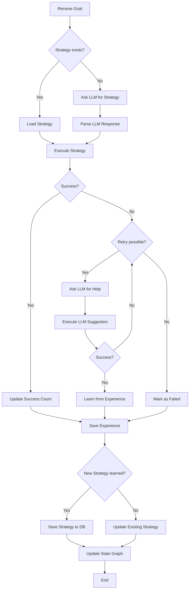

# Cognitive RPA Agent - Requirements & Architecture

**Status**: 🚧 In Planning  
**Priority**: ⭐⭐⭐ **CORE CPA CAPABILITY**  
**Date**: 2025-11-03

---

## 📋 User Requirements

### Vision

Ein **selbstlernendes, LLM-gestütztes RPA-System mit Erfahrungsgedächtnis**, das:

1. **Komplexe Aufgaben autonom ausführt**
   - Beispiel: "Suche Rechnung aus Buchhaltung und sende per Email via Outlook"
   - Beispiel: "Finde Datei in Projektordner und sende per Email"

2. **Strategien lernt und speichert**
   - Diskret gelernte Aufgaben (z.B. "Pop-up wegklicken")
   - Erfahrungen sammeln und wiederverwenden
   - Über Zeit immer selbständiger werden (weniger LLM-Abhängigkeit)

3. **Zustandsgraphen aufbaut**
   - Lernt Pfade von A nach B (z.B. "Outlook öffnen" → "Email schreiben" → "Email senden")
   - Erkennt Umwege und Hindernisse
   - Weiß, wo er gerade im Graphen ist

4. **LLM bei Unsicherheit nutzt**
   - Bei unbekannten Situationen: Screenshot + Kontext → LLM
   - LLM schlägt nächste Schritte vor
   - Agent führt aus und lernt daraus

### Beispiel-Szenario: Email senden mit Outlook

**Situation**: Agent soll Email mit Anhang senden

**Ablauf**:
1. **Ziel**: Email senden
2. **Vorbedingung prüfen**: Ist Outlook geöffnet?
   - **Nein** → Strategie "Outlook öffnen" ausführen (falls bekannt) oder LLM fragen
   - **Ja** → Weiter zu Schritt 3
3. **Strategie ausführen**: "Email schreiben und senden"
   - Falls bekannt: Gespeicherte Strategie ausführen
   - Falls unbekannt: LLM fragen, ausführen, lernen
4. **Hindernisse behandeln**: Pop-ups, Fehler, etc.
   - Falls bekannt: Gespeicherte Lösung anwenden
   - Falls unbekannt: LLM fragen, ausführen, lernen
5. **Erfolg verifizieren**: Email im "Gesendet"-Ordner?
6. **Erfahrung speichern**: Erfolgreiche Pfade, Hindernisse, Lösungen

---

## 🏗️ Architecture

### High-Level Components

```
Cognitive RPA Agent
├── Execution Layer (✅ Implemented)
│   ├── Click, Type, Wait, Screenshot
│   └── PyAutoGUI Integration
├── Vision Layer (🆕 To Implement)
│   ├── Screen Analysis (OCR, Element Detection)
│   ├── State Detection (Window titles, GUI elements)
│   └── Windows API Integration
├── Cognitive Layer (🆕 To Implement)
│   ├── Agent Identity & Capabilities
│   ├── State Graph (Zustandsgraph)
│   ├── Strategy Manager (Playbooks)
│   ├── Experience Memory
│   └── LLM Wrapper (ChatGPT)
└── Planning Layer (🆕 To Implement)
    ├── Goal Planner (High-level)
    └── Action Planner (Low-level)
```

### Directory Structure

```
agents/desktop_rpa/
├── main.py                          # FastAPI App (✅ Implemented)
├── config/
│   └── settings.py                  # Config (✅ Implemented)
├── executors/                       # Low-level Actions (✅ Implemented)
│   ├── click_executor.py
│   ├── type_executor.py
│   ├── wait_executor.py
│   └── screenshot_executor.py
├── cognitive/                       # 🆕 Cognitive Layer
│   ├── __init__.py
│   ├── agent_identity.py            # Agent Identity & Capabilities
│   ├── state_graph.py               # State Graph (Zustandsgraph)
│   ├── strategy_manager.py          # Strategy/Playbook Management
│   ├── experience_memory.py         # Experience Storage (SQLite)
│   └── llm_wrapper.py               # LLM Integration (ChatGPT)
├── vision/                          # 🆕 Vision Layer
│   ├── __init__.py
│   ├── screen_analyzer.py           # Screen Analysis (OCR, Element Detection)
│   ├── state_detector.py            # State Detection
│   └── windows_api.py               # Windows API Integration (UI Automation)
└── planner/                         # 🆕 Planning Layer
    ├── __init__.py
    ├── goal_planner.py              # High-level Goal Planning
    └── action_planner.py            # Low-level Action Planning
```

---

## 🎯 Technology Decisions

### LLM Provider
- **Primary**: ChatGPT API (GPT-4o or GPT-4 Vision)
- **Future**: Llama (local models via Ollama)
- **Rationale**: Start with proven API, add local models later for cost/privacy

### Vision & UI Automation
- **Windows API (UI Automation)**: Primary method for element detection
  - Read window titles
  - Detect GUI elements (buttons, text fields, etc.)
  - Get element text and position
  - **Library**: `pywinauto` or `uiautomation`
- **OCR (pytesseract)**: Fallback for text recognition
  - When UI Automation fails
  - For legacy applications
- **Computer Vision (OpenCV)**: Optional for advanced scenarios
  - Template matching
  - Visual element detection

**Rationale**: Windows API is faster and more reliable than OCR. OCR as fallback.

### Mouse & Keyboard Simulation
- **PyAutoGUI**: Already implemented ✅
- **Windows API (SendInput)**: For more reliable input simulation
- **Rationale**: PyAutoGUI is simple, Windows API is more robust

### State Detection
- **Rule-based**: Start with clear rules
  - State transitions based on observable conditions
  - Example: "Email written" → "Email sent" → "Email in Sent folder" → "Outlook closed"
- **Future**: ML-based with confidence weights
- **Rationale**: Rules are easier to debug and understand. ML can be added later.

### Graph Storage
- **SQLite**: Primary storage for state graphs and experiences
  - Free, no external dependencies
  - Easy to query and visualize
  - Supports versioning (revision history)
- **Visualization**: Export to GraphViz/Mermaid for visualization
- **Rationale**: SQLite is simple, portable, and sufficient for local agent

### Strategy Format
- **JSON**: Primary format for strategies
  - Easy to serialize/deserialize
  - Human-readable
  - Can be validated with JSON Schema
  - Easy to store in SQLite
- **Alternative**: YAML for human editing (can convert to/from JSON)
- **Rationale**: JSON is universal and well-supported

---

## 📊 Data Models

### 1. Agent Identity

```python
class AgentIdentity(BaseModel):
    agent_id: str
    name: str
    role: str  # e.g., "Desktop RPA Agent"
    capabilities: list[str]  # ["click", "type", "outlook", "excel", ...]
    learned_strategies: list[str]  # Strategy IDs
    version: str
```

### 2. State Graph

```python
class State(BaseModel):
    state_id: str
    name: str  # e.g., "outlook_closed", "outlook_open", "email_compose"
    description: str
    detection_rules: dict[str, Any]  # Rules to detect this state
    screenshot_hash: str | None  # Optional: for visual recognition
    metadata: dict[str, Any]

class Transition(BaseModel):
    transition_id: str
    from_state: str
    to_state: str
    actions: list[dict[str, Any]]  # Actions to perform
    success_rate: float  # 0.0 - 1.0
    execution_count: int
    average_duration: float  # seconds
    metadata: dict[str, Any]

class StateGraph(BaseModel):
    graph_id: str
    name: str  # e.g., "Send Email via Outlook"
    description: str
    states: dict[str, State]
    transitions: list[Transition]
    entry_state: str  # Starting state
    goal_states: list[str]  # Success states
    created_at: datetime
    updated_at: datetime
    revision: int  # Version number
```

### 3. Strategy (Playbook)

```python
class Strategy(BaseModel):
    strategy_id: str
    name: str  # e.g., "Send Email via Outlook"
    description: str
    goal: str  # High-level goal
    preconditions: list[str]  # Required states/conditions
    steps: list[dict[str, Any]]  # Actions or sub-goals
    success_count: int
    failure_count: int
    average_duration: float
    learned_from: str  # "llm", "manual", "experience"
    created_at: datetime
    updated_at: datetime
    graph_id: str | None  # Associated state graph
```

### 4. Experience

```python
class Experience(BaseModel):
    experience_id: str
    timestamp: datetime
    goal: str
    initial_state: str
    final_state: str
    actions_taken: list[dict[str, Any]]
    success: bool
    duration: float  # seconds
    obstacles: list[dict[str, Any]]  # Pop-ups, errors, etc.
    obstacle_solutions: list[dict[str, Any]]
    llm_used: bool
    llm_calls: int
    strategy_id: str | None
    graph_id: str | None
    metadata: dict[str, Any]
```

### 5. LLM Request/Response

```python
class LLMRequest(BaseModel):
    goal: str
    current_state: str
    screenshot_base64: str
    context: dict[str, Any]
    previous_actions: list[dict[str, Any]]
    obstacles: list[dict[str, Any]]

class LLMResponse(BaseModel):
    action: str  # "click", "type", "wait_for", etc.
    selector: str
    text: str | None
    reasoning: str
    confidence: float  # 0.0 - 1.0
    alternative_actions: list[dict[str, Any]]  # Fallback options
```

---

## 🔄 Workflow: Goal Execution with Learning



---

## 🚀 Implementation Phases

### Phase 1: LLM Wrapper (Foundation) 🎯 **START HERE**
**Goal**: Enable agent to ask ChatGPT for help

**Tasks**:
1. Create `cognitive/llm_wrapper.py`
2. Implement ChatGPT API integration (GPT-4o/GPT-4 Vision)
3. Screenshot → Base64 encoding
4. Prompt engineering for Desktop RPA
5. Response parsing and validation
6. Error handling and retries
7. Tests with mock LLM

**Deliverables**:
- `LLMWrapper` class with `ask_for_next_action()` and `ask_for_strategy()`
- Unit tests
- Example prompts and responses

---

### Phase 2: Vision Layer
**Goal**: Enable agent to "see" and understand the screen

**Tasks**:
1. Create `vision/windows_api.py` - Windows UI Automation
   - Detect windows and their titles
   - Find GUI elements (buttons, text fields, etc.)
   - Get element properties (text, position, state)
2. Create `vision/screen_analyzer.py` - OCR fallback
   - pytesseract integration
   - Text extraction from screenshots
3. Create `vision/state_detector.py` - State detection
   - Rule-based state detection
   - Window title matching
   - Element presence checking
4. Tests

**Deliverables**:
- Windows API integration
- OCR fallback
- State detection rules
- Unit tests

---

### Phase 3: State Graph
**Goal**: Enable agent to build and navigate state graphs

**Tasks**:
1. Create `cognitive/state_graph.py`
   - State and Transition models
   - Graph building and navigation
   - Path finding (A* or Dijkstra)
2. SQLite schema for graphs
3. Graph versioning (revisions)
4. Graph visualization export (GraphViz/Mermaid)
5. Tests

**Deliverables**:
- State graph implementation
- SQLite storage
- Visualization export
- Unit tests

---

### Phase 4: Strategy Manager
**Goal**: Enable agent to store and execute strategies

**Tasks**:
1. Create `cognitive/strategy_manager.py`
   - Strategy CRUD operations
   - Strategy execution engine
   - Success/failure tracking
2. JSON strategy format
3. SQLite storage
4. Strategy versioning
5. Tests

**Deliverables**:
- Strategy manager
- JSON format specification
- SQLite storage
- Unit tests

---

### Phase 5: Experience Memory
**Goal**: Enable agent to learn from experiences

**Tasks**:
1. Create `cognitive/experience_memory.py`
   - Experience storage (SQLite)
   - Experience retrieval and querying
   - Pattern recognition (similar experiences)
2. SQLite schema
3. Experience analysis (success patterns, common obstacles)
4. Tests

**Deliverables**:
- Experience memory implementation
- SQLite storage
- Query and analysis functions
- Unit tests

---

### Phase 6: Goal Planner
**Goal**: Enable agent to plan and execute complex goals

**Tasks**:
1. Create `planner/goal_planner.py`
   - High-level goal decomposition
   - Sub-goal identification
   - Goal-to-strategy mapping
2. Create `planner/action_planner.py`
   - Low-level action planning
   - Action sequencing
   - Precondition checking
3. Integration with LLM, State Graph, Strategy Manager
4. Tests

**Deliverables**:
- Goal planner
- Action planner
- Integration layer
- Unit tests

---

### Phase 7: Integration & Learning Loop
**Goal**: Integrate all components into a working system

**Tasks**:
1. Integrate all components
2. Implement main learning loop
3. End-to-end testing with real scenarios
4. Performance optimization
5. Documentation

**Deliverables**:
- Fully integrated cognitive RPA agent
- End-to-end tests
- Performance benchmarks
- User documentation

---

## 📈 Success Metrics

1. **Autonomy**: % of tasks completed without LLM help (should increase over time)
2. **Success Rate**: % of goals successfully achieved
3. **Learning Speed**: Time to learn new strategy (should decrease over time)
4. **LLM Cost**: Cost per task (should decrease over time)
5. **Execution Time**: Time to complete task (should decrease over time)

---

## 🔐 Security & Privacy

1. **API Keys**: Store ChatGPT API key securely (environment variable, not in code)
2. **Screenshots**: Sensitive data in screenshots - consider redaction
3. **Experience Data**: May contain sensitive information - secure storage
4. **LLM Prompts**: Don't send sensitive data to external LLM (option for local Llama)

---

## 🎯 Next Steps

1. ✅ Document requirements (this file)
2. ⏳ Implement Phase 1: LLM Wrapper
3. ⏳ Implement Phase 2: Vision Layer
4. ⏳ Implement Phase 3: State Graph
5. ⏳ Implement Phase 4: Strategy Manager
6. ⏳ Implement Phase 5: Experience Memory
7. ⏳ Implement Phase 6: Goal Planner
8. ⏳ Implement Phase 7: Integration & Learning Loop

---

**This is the CORE of the CPA capability!** 🚀

