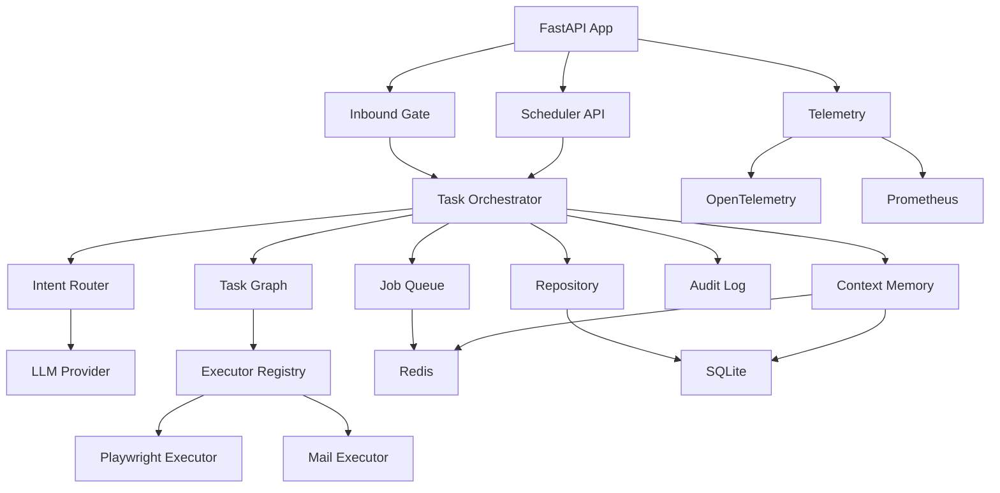
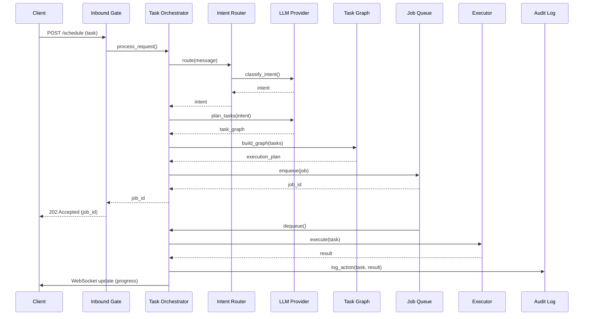
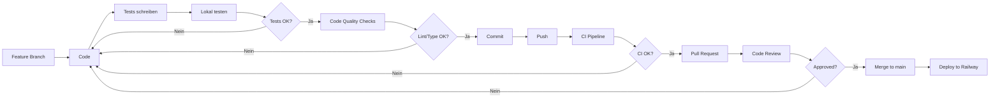

# 📁 CPA Scheduler - Projektstruktur

## Verzeichnis-Übersicht

```
01_CPA/
├── 📄 README.md                    # Projekt-Übersicht & Quick Start
├── 📄 pyproject.toml               # Poetry Dependencies & Config
├── 📄 Dockerfile                   # Multi-stage Docker Build
├── 📄 docker-compose.yml           # Docker Services (Redis, Jaeger, etc.)
├── 📄 .env.example                 # Environment Variables Template
├── 📄 .gitignore                   # Git Ignore Rules
│
├── 📂 scheduler/                   # 🎯 Hauptanwendung
│   ├── __init__.py
│   ├── main.py                     # FastAPI Application Entry Point
│   │
│   ├── 📂 core/                    # Kern-Komponenten
│   │   ├── lam_protocol.py         # LAM Message Models (Pydantic)
│   │   ├── task_graph.py           # ToDo Schema & Dependency Resolution
│   │   ├── intent_router.py        # Intent Classification (Rule-based)
│   │   └── task_executor_interface.py  # Abstract Executor Interface
│   │
│   ├── 📂 api/                     # FastAPI Endpoints
│   │   ├── inbound_gate.py         # POST /schedule, POST /lam/message
│   │   └── scheduler_api.py        # GET/DELETE /jobs, WebSocket
│   │
│   ├── 📂 orchestrator/            # Task Orchestration
│   │   └── task_orchestrator.py    # Main Orchestration Logic
│   │
│   ├── 📂 llm/                     # LLM Integration
│   │   ├── llm_provider.py         # Abstract LLM Interface
│   │   ├── openai_provider.py      # OpenAI Implementation
│   │   ├── mock_provider.py        # Mock für Tests
│   │   ├── llm_intent_router.py    # LLM-based Intent Routing
│   │   └── llm_task_planner.py     # LLM-based Task Planning
│   │
│   ├── 📂 prompts/                 # Jinja2 Prompt Templates
│   │   ├── intent_classification.jinja2
│   │   └── task_planning.jinja2
│   │
│   ├── 📂 queue/                   # Job Queue
│   │   └── job_queue.py            # Redis Queue Wrapper
│   │
│   ├── 📂 repository/              # Database Layer
│   │   ├── repository_interface.py # Abstract Repository
│   │   ├── sqlite_repository.py    # SQLite Implementation
│   │   └── schema.sql              # Database Schema
│   │
│   ├── 📂 audit/                   # Audit Trail
│   │   └── audit_log.py            # Action Logging & Screenshot Storage
│   │
│   ├── 📂 memory/                  # Context Memory (RAG)
│   │   ├── context_memory.py       # Short-term (Redis) & Long-term (SQLite)
│   │   └── embedding_service.py    # Text → Vector (OpenAI Embeddings)
│   │
│   ├── 📂 executors/               # Task Executors
│   │   ├── base_executor.py        # Abstract Executor
│   │   ├── executor_registry.py    # Executor Registry & Dispatch
│   │   ├── playwright_executor.py  # Web Automation (Playwright)
│   │   └── mail_executor.py        # Email (Microsoft Graph API)
│   │
│   ├── 📂 security/                # Security & Policies
│   │   ├── auth.py                 # JWT Authentication
│   │   ├── policies.py             # Policy Engine (Allowlist, Blacklist, PII)
│   │   └── secrets_manager.py      # Secrets Management (Vault)
│   │
│   ├── 📂 telemetry/               # Observability
│   │   ├── telemetry.py            # OpenTelemetry Setup
│   │   └── grafana_dashboard.json  # Grafana Dashboard Definition
│   │
│   ├── 📂 monitoring/              # Monitoring Config
│   │   ├── prometheus.yml          # Prometheus Configuration
│   │   └── alerts.yaml             # Alerting Rules
│   │
│   └── 📂 config/                  # Configuration Files
│       ├── intents.yaml            # Intent Registry (Rule-based)
│       └── policies.yaml           # Security Policies
│
├── 📂 tests/                       # 🧪 Test Suite
│   ├── __init__.py
│   ├── conftest.py                 # Pytest Fixtures
│   │
│   ├── 📂 core/                    # Core Component Tests
│   │   ├── test_lam_protocol.py
│   │   ├── test_task_graph.py
│   │   └── test_intent_router.py
│   │
│   ├── 📂 api/                     # API Tests
│   │   ├── test_main.py
│   │   ├── test_inbound_gate.py
│   │   └── test_scheduler_api.py
│   │
│   ├── 📂 orchestrator/            # Orchestrator Tests
│   │   └── test_task_orchestrator.py
│   │
│   ├── 📂 llm/                     # LLM Tests
│   │   ├── test_llm_provider.py
│   │   ├── test_llm_intent_router.py
│   │   └── test_llm_task_planner.py
│   │
│   ├── 📂 queue/                   # Queue Tests
│   │   └── test_job_queue.py
│   │
│   ├── 📂 repository/              # Repository Tests
│   │   └── test_sqlite_repository.py
│   │
│   ├── 📂 audit/                   # Audit Tests
│   │   └── test_audit_log.py
│   │
│   ├── 📂 memory/                  # Memory Tests
│   │   └── test_context_memory.py
│   │
│   ├── 📂 executors/               # Executor Tests
│   │   ├── test_executor_registry.py
│   │   ├── test_playwright_executor.py
│   │   └── test_mail_executor.py
│   │
│   ├── 📂 security/                # Security Tests
│   │   └── test_policies.py
│   │
│   ├── 📂 telemetry/               # Telemetry Tests
│   │   └── test_telemetry.py
│   │
│   ├── 📂 integration/             # End-to-End Tests
│   │   └── test_e2e_workflow.py
│   │
│   └── 📂 load/                    # Load Tests
│       └── locustfile.py
│
├── 📂 docs/                        # 📚 Dokumentation
│   ├── ARCHITECTURE.md             # System-Architektur
│   ├── TODO.md                     # Umsetzungsplan (8 Phasen)
│   ├── PROJECT_STATUS.md           # Aktueller Projekt-Status
│   ├── PROJECT_STRUCTURE.md        # Diese Datei
│   ├── API_EXAMPLES.md             # API Usage Examples (geplant)
│   ├── LAM_PROTOCOL.md             # LAM Specification (geplant)
│   ├── EXECUTOR_GUIDE.md           # Executor Development Guide (geplant)
│   └── DEPLOYMENT.md               # Deployment Guide (geplant)
│
└── 📂 data/                        # 💾 Daten & Persistenz
    ├── .gitkeep
    ├── scheduler.db                # SQLite Database (wird erstellt)
    └── 📂 screenshots/             # Audit Screenshots
        └── .gitkeep
```

## Komponenten-Abhängigkeiten



## Datenfluss



## Technologie-Stack pro Komponente

| Komponente | Technologien |
|------------|--------------|
| **API** | FastAPI, Pydantic, uvicorn |
| **Queue** | Redis, aioredis |
| **Database** | SQLite, SQLAlchemy, Alembic |
| **LLM** | OpenAI API, Jinja2 |
| **Executors** | Playwright, MSAL (Graph API) |
| **Observability** | OpenTelemetry, Prometheus, Grafana |
| **Security** | python-jose (JWT), slowapi (Rate Limiting) |
| **Testing** | pytest, pytest-asyncio, Locust |
| **Deployment** | Docker, Railway |

## Entwicklungs-Workflow



## Nächste Schritte

1. **Phase 1.2**: LAM Protocol Implementation
   - `scheduler/core/lam_protocol.py`
   - `tests/core/test_lam_protocol.py`

2. **Phase 1.3**: Task Graph Implementation
   - `scheduler/core/task_graph.py`
   - `tests/core/test_task_graph.py`

3. **Phase 1.4**: Intent Router Implementation
   - `scheduler/core/intent_router.py`
   - `scheduler/config/intents.yaml`
   - `tests/core/test_intent_router.py`

Siehe `docs/TODO.md` für vollständigen Plan.

---

**Letzte Aktualisierung**: 2025-11-03

