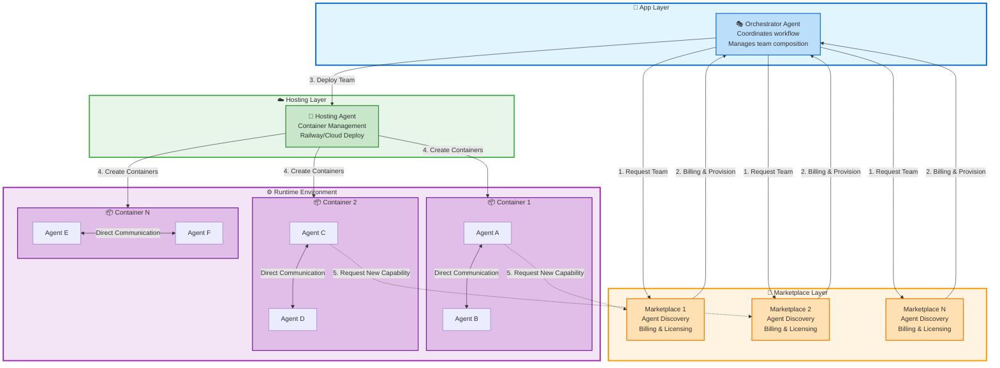

# 🏗️ Agentify Platform Architecture

**How Apps, Orchestrators, Marketplaces, and Hosting work together**

---

## 📐 **Architecture Overview**

The Agentify Platform follows a **modular, marketplace-driven architecture** where apps dynamically compose teams of agents from one or more marketplaces, handle billing, and deploy to hosting providers.

---

## 🎯 **Core Principles**

1. **Apps contain Orchestrator Agents** - Coordinate the entire workflow
2. **Marketplaces provide Agent Teams** - Discover, bill, and provision agents
3. **Hosting Agents deploy Containers** - Run agents in isolated environments (e.g., Railway)
4. **Agents communicate directly** - Peer-to-peer within containers
5. **Dynamic capability expansion** - Agents request new capabilities from marketplace on-demand

---

## 📊 **Architecture Diagram**

### **Compact View**

```
🎯 App Layer (Blue)
    ↓
🏪 Marketplace Layer (Orange) - 3 Marketplaces in parallel
    ↓
🚀 Hosting Layer (Green) - Container Management
    ↓
⚙️ Runtime Environment (Purple) - 3 Containers with Agents
    ↓
🔄 Direct Communication + Dynamic Expansion
```

### **Detailed View**



---

## 🔄 **Workflow Steps**

### **Step 1: Team Composition**
```
App Orchestrator → Marketplace(s)
```
- Orchestrator requests agents with specific capabilities
- Can query multiple marketplaces simultaneously
- Receives agent manifests and pricing

### **Step 2: Billing & Provisioning**
```
Marketplace → Orchestrator
```
- Marketplace handles billing/licensing
- Provisions agent instances
- Returns deployment-ready agent packages

### **Step 3: Deployment**
```
Orchestrator → Hosting Agent
```
- Orchestrator hands team to Hosting Agent
- Hosting Agent creates containers (e.g., Railway)
- Deploys agents into isolated environments

### **Step 4: Runtime Communication**
```
Agent ↔ Agent (Direct)
```
- Agents communicate peer-to-peer within containers
- No orchestrator mediation needed
- High-performance, low-latency

### **Step 5: Dynamic Expansion**
```
Agent → Marketplace (On-Demand)
```
- Agent discovers it needs new capability
- Requests additional agents from marketplace
- Marketplace bills and provisions
- New agents join existing containers

---

## 🧩 **Component Responsibilities**

### **🎯 App / Orchestrator Agent**
- Define workflow and required capabilities
- Compose teams from marketplace(s)
- Coordinate deployment via Hosting Agent
- Monitor team health and performance

### **🏪 Marketplace**
- Agent discovery and search
- Billing and licensing
- Agent provisioning
- Capability matching

### **🚀 Hosting Agent**
- Container orchestration (Railway, AWS, GCP, etc.)
- Resource allocation
- Scaling and load balancing
- Health monitoring

### **⚙️ Runtime Agents**
- Execute assigned tasks
- Direct peer-to-peer communication
- Request new capabilities when needed
- Report health and status

---

## 📦 **Container Architecture**

```
┌─────────────────────────────────────────┐
│  📦 Container (Railway/Cloud)           │
├─────────────────────────────────────────┤
│  🤖 Agent A (Data Processing)           │
│  🤖 Agent B (API Integration)           │
│  🤖 Agent C (Validation)                │
├─────────────────────────────────────────┤
│  📡 Direct Communication Layer          │
│  🔒 Security & Isolation                │
│  📊 Health Monitoring                   │
└─────────────────────────────────────────┘
```

**Benefits:**
- ✅ Isolation and security
- ✅ Independent scaling
- ✅ Resource optimization
- ✅ Easy deployment and rollback

---

## 🔄 **Dynamic Capability Expansion**

**Scenario:** Agent needs new capability during runtime

```
1. Agent A: "I need PDF parsing capability"
   ↓
2. Agent A → Marketplace: "Find PDF parser agent"
   ↓
3. Marketplace: Billing + Provision PDF Parser Agent
   ↓
4. Marketplace → Container: Deploy PDF Parser Agent
   ↓
5. Agent A ↔ PDF Parser Agent: Direct communication
```

**Key Points:**
- No app restart required
- Automatic billing
- Seamless integration
- On-demand scaling

---

## 💰 **Billing Flow**

```
┌──────────────┐
│ Orchestrator │
└──────┬───────┘
       │ 1. Request Team
       ↓
┌──────────────┐
│ Marketplace  │
├──────────────┤
│ • Calculate  │
│ • Bill User  │
│ • License    │
└──────┬───────┘
       │ 2. Provision
       ↓
┌──────────────┐
│ Agent Team   │
└──────────────┘
```

**Billing happens at:**
- Initial team composition
- Dynamic capability requests
- Usage-based metering (optional)

---

## 🌐 **Multi-Marketplace Support**

Apps can use agents from **multiple marketplaces simultaneously**:

```
Orchestrator
    ├─→ Marketplace A (Data Agents)
    ├─→ Marketplace B (AI Agents)
    └─→ Marketplace C (Integration Agents)
```

**Benefits:**
- Best-of-breed agent selection
- Competitive pricing
- Redundancy and failover
- Specialized marketplaces

---

## 🚀 **Deployment Example**

### **Railway Deployment**

```yaml
# railway.toml
[build]
  builder = "DOCKERFILE"

[deploy]
  numReplicas = 3
  restartPolicyType = "ON_FAILURE"

[env]
  AGENT_MANIFEST = "agent_team.json"
  MARKETPLACE_URL = "https://marketplace.agentify.ai"
```

### **Agent Team Manifest**

```json
{
  "team_id": "team.myapp.processing",
  "agents": [
    {
      "agent_id": "agent.marketplace1.data-processor",
      "source": "https://marketplace1.com"
    },
    {
      "agent_id": "agent.marketplace2.ai-analyzer",
      "source": "https://marketplace2.com"
    }
  ],
  "hosting": {
    "provider": "railway",
    "region": "us-west-2"
  }
}
```

---

## 📚 **Related Documentation**

- [Developer Guide](DEVELOPER_GUIDE.md) - How to build apps and agents
- [Marketplace Requirements](marketplace/MARKETPLACE_REQUIREMENTS.md) - Build your own marketplace
- [Hosting Requirements](hosting/HOSTING_AGENT_REQUIREMENTS.md) - Deploy to any cloud
- [Agent Standard](agent_standard/README.md) - Universal agent format

---

**🎯 This architecture enables:**
- ✅ Dynamic team composition
- ✅ Multi-marketplace support
- ✅ Automatic billing
- ✅ Flexible hosting
- ✅ On-demand scaling
- ✅ Direct agent communication

